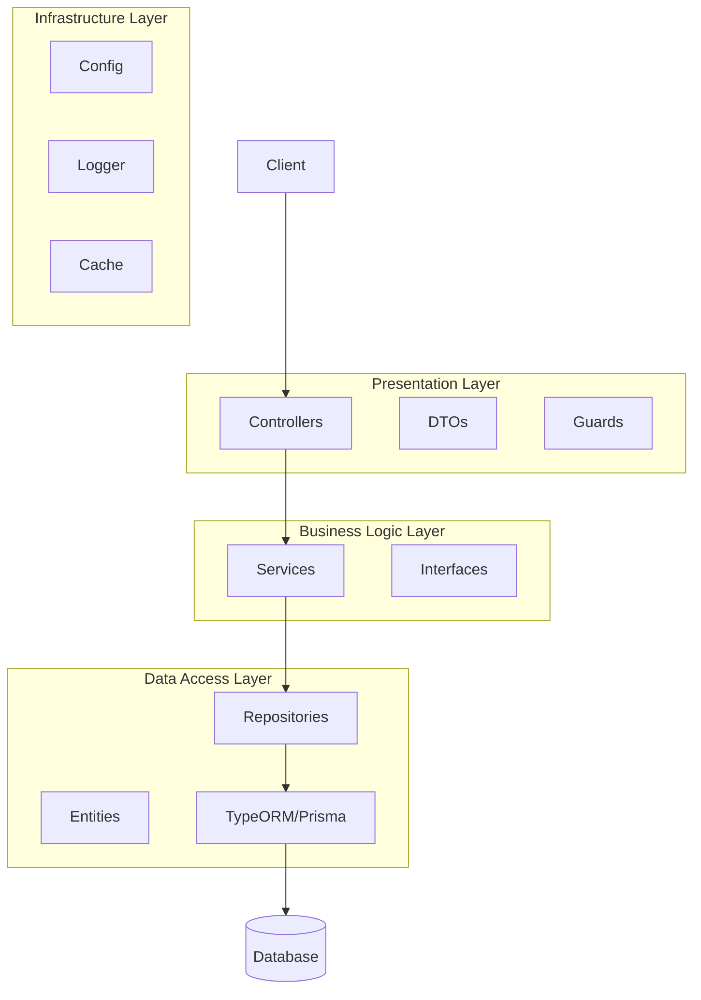

# Настройки Backend Приложения

## Содержание

1. [Технологический стек](#технологический-стек)
2. [Архитектура](#архитектура)
3. [Структура проекта](#структура-проекта)
4. [Связанные документы](#связанные-документы)

---

## Технологический стек

**NestJS** — [NEST_JS_ARCHITECTURE.md](./nestjs/NEST_JS_ARCHITECTURE.md)

Фреймворк для построения серверных приложений на Node.js. Модульная архитектура, TypeScript-first, встроенный DI контейнер. Поддержка REST API, GraphQL, WebSockets, микросервисов.

**SQL Database** — [DATABASE.md](./DATABASE.md)

Реляционные базы данных: PostgreSQL, MySQL, SQLite. Теория реляционных БД, нормализация, индексы, транзакции, связи между таблицами. Примеры SQL запросов для CRUD операций.

**Database Migrations** — [MIGRATIONS.md](./MIGRATIONS.md)

Управление изменениями схемы БД. TypeORM migrations, версионирование структуры данных, rollback стратегии, seeding тестовых данных. Автоматизация через CLI.

**Testing** — [BACKEND_TESTING.md](./BACKEND_TESTING.md)

TDD подход для backend. Unit тесты сервисов, интеграционные тесты API, тестирование cron jobs. Jest, testing-library, supertest. Best practices изоляции и мокирования.

---

## Архитектура

**Многослойная архитектура (Layered Architecture)**



---

## Структура проекта

```
backend/
├── src/
│   ├── main.ts                 # Точка входа
│   ├── app.module.ts           # Корневой модуль
│   ├── config/                 # Конфигурация
│   │   ├── database.config.ts
│   │   └── app.config.ts
│   ├── common/                 # Общие модули
│   │   ├── decorators/
│   │   ├── filters/
│   │   ├── guards/
│   │   ├── interceptors/
│   │   └── pipes/
│   ├── modules/                # Feature модули
│   │   ├── users/
│   │   │   ├── users.module.ts
│   │   │   ├── users.controller.ts
│   │   │   ├── users.service.ts
│   │   │   ├── users.repository.ts
│   │   │   ├── dto/
│   │   │   │   ├── create-user.dto.ts
│   │   │   │   └── update-user.dto.ts
│   │   │   └── entities/
│   │   │       └── user.entity.ts
│   │   └── auth/
│   ├── database/               # Миграции и сиды
│   │   ├── migrations/
│   │   └── seeds/
│   └── shared/                 # Переиспользуемый код
│       ├── utils/
│       └── types/
├── test/
│   ├── unit/                   # Unit тесты
│   ├── integration/            # Интеграционные тесты
│   └── e2e/                    # E2E тесты
├── docker-compose.yml
└── package.json
```

---

## Связанные документы

### Core Framework
- [NEST_JS_ARCHITECTURE.md](./nestjs/NEST_JS_ARCHITECTURE.md) — Архитектура NestJS
- [MODULE.md](./nestjs/MODULE.md) — Модули
- [CONTROLLER.md](./nestjs/CONTROLLER.md) — Контроллеры
- [SERVICE.md](./nestjs/SERVICE.md) — Сервисы
- [DEPENDENCY_INJECTION.md](./nestjs/DEPENDENCY_INJECTION.md) — DI

### Database
- [DATABASE.md](./DATABASE.md) — SQL основы, теория БД
- [MIGRATIONS.md](./MIGRATIONS.md) — Миграции и версионирование
- [REPOSITORY.md](./nestjs/REPOSITORY.md) — Repository pattern
- [ENTITY.md](./nestjs/ENTITY.md) — Entity definitions

### Testing & Quality
- [BACKEND_TESTING.md](./BACKEND_TESTING.md) — TDD, тестирование сервисов, интеграций, cron
- [PIPE.md](./nestjs/PIPE.md) — Валидация
- [GUARD.md](./nestjs/GUARD.md) — Авторизация

### Infrastructure
- [EXCEPTION_FILTER.md](./nestjs/EXCEPTION_FILTER.md) — Обработка ошибок
- [INTERCEPTOR.md](./nestjs/INTERCEPTOR.md) — Перехват запросов
- [LIFECYCLE_HOOKS.md](./nestjs/LIFECYCLE_HOOKS.md) — Жизненный цикл
