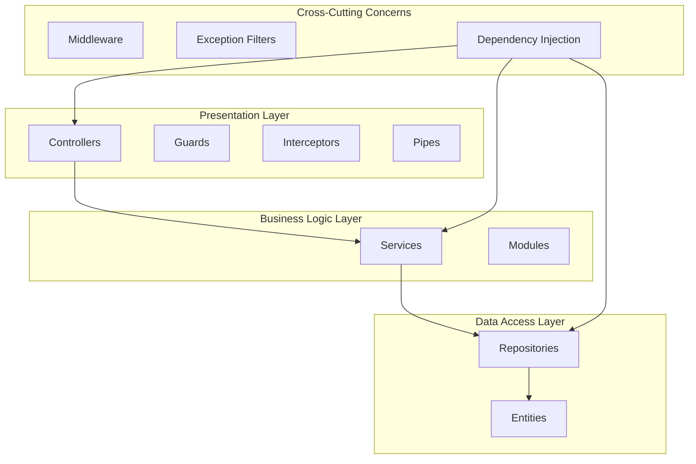
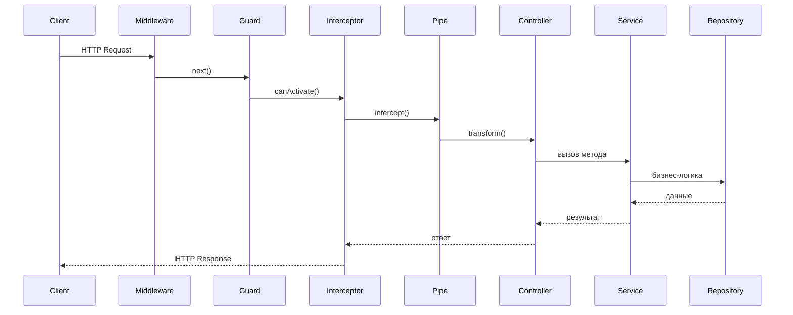

# Архитектура NestJS

## Содержание

1. [Обзор](#обзор)
2. [Философия NestJS](#философия-nestjs)
3. [Архитектурные слои](#архитектурные-слои)
4. [Жизненный цикл запроса](#жизненный-цикл-запроса)
5. [Ключевые компоненты](#ключевые-компоненты)
6. [Структура проекта](#структура-проекта)
7. [Связанные документы](#связанные-документы)

---

## Обзор

NestJS — прогрессивный Node.js фреймворк для создания эффективных, надёжных и масштабируемых серверных приложений. Построен на TypeScript и использует современные паттерны проектирования: OOP, FP и FR.

## Философия NestJS

**Модульность** — приложение разбивается на изолированные модули с чёткими границами ответственности.

**TypeScript-first** — полная поддержка TypeScript из коробки с продвинутой типизацией и декораторами.

**Angular-подход** — знакомая структура для frontend-разработчиков: декораторы, DI, провайдеры.

**Платформонезависимость** — один код работает с Express, Fastify или другими HTTP адаптерами.

## Архитектурные слои



## Жизненный цикл запроса



## Ключевые компоненты

### Core Layer (Ядро)

**Module** — [MODULE.md](./MODULE.md)

Организационная единица приложения. Группирует связанные компоненты: контроллеры, сервисы, провайдеры. Каждое NestJS приложение имеет хотя бы один корневой модуль. `@Module()` декоратор определяет метаданные модуля.

**Controller** — [CONTROLLER.md](./CONTROLLER.md)

Обрабатывает входящие HTTP запросы и возвращает ответы клиенту. Определяет маршруты (routes) и привязывает их к методам класса через декораторы `@Get()`, `@Post()` и т.д. Отвечает только за приём/отправку данных, бизнес-логика делегируется сервисам.

**Service/Provider** — [SERVICE.md](./SERVICE.md)

Содержит бизнес-логику приложения. Это обычные классы с декоратором `@Injectable()`, которые могут быть внедрены в другие компоненты через Dependency Injection. Сервисы не зависят от HTTP слоя и могут быть переиспользованы.

### Data Access Layer (Доступ к данным)

**Repository** — [REPOSITORY.md](./REPOSITORY.md)

Абстракция над источником данных. Инкапсулирует логику работы с БД: CRUD операции, сложные запросы. Repository Pattern позволяет легко менять ORM или тип хранилища без изменения бизнес-логики.

**Entity** — [ENTITY.md](./ENTITY.md)

Класс, представляющий таблицу в базе данных. Определяет структуру данных, типы полей, связи между таблицами. Используется ORM (TypeORM, Prisma) для маппинга объектов на реляционные таблицы.

### Cross-Cutting Layer (Сквозная функциональность)

**Guard** — [GUARD.md](./GUARD.md)

Определяет, может ли текущий пользователь выполнить запрос. Реализует авторизацию и аутентификацию. Работает после Middleware, но до Controller. Возвращает `true` (доступ разрешён) или `false` (доступ запрещён). `@UseGuards()`

**Pipe** — [PIPE.md](./PIPE.md)

Трансформирует входные данные (параметры запроса, body, query) и выполняет валидацию. Может преобразовывать типы, проверять формат email, валидировать DTO. `@UsePipes()` или параметрические декораторы `@Body()`, `@Param()`.

**Interceptor** — [INTERCEPTOR.md](./INTERCEPTOR.md)

Перехватывает входящие запросы и исходящие ответы. Используется для: логирования, кэширования, трансформации ответов, обработки таймаутов, изменения исключений. `@UseInterceptors()`

**Middleware** — [MIDDLEWARE.md](./MIDDLEWARE.md)

Функция, выполняющаяся до обработки запроса роутером. Имеет доступ к `request` и `response` объектам. Используется для: логирования запросов, CORS, парсинга cookies, аутентификации на уровне приложения. `app.use()` или `@Middleware()`

**Exception Filter** — [EXCEPTION_FILTER.md](./EXCEPTION_FILTER.md)

Перехватывает необработанные исключения и формирует понятный ответ клиенту. Преобразует стандартные ошибки Node.js/NestJS в форматированный JSON с кодом статуса HTTP. `@Catch()`

### Infrastructure (Инфраструктура)

**Dependency Injection** — [DEPENDENCY_INJECTION.md](./DEPENDENCY_INJECTION.md)

Паттерн проектирования, при котором зависимости компонентов предоставляются извне, а не создаются внутри. NestJS использует собственный DI контейнер для управления жизненным циклом и внедрения зависимостей. `@Injectable()`, constructor injection.

**Decorator** — [DECORATOR.md](./DECORATOR.md)

TypeScript декораторы — основной механизм метаданных в NestJS. `@Controller()`, `@Get()`, `@Injectable()`, `@Module()` — все они добавляют мета-информацию, которую Nest использует для построения приложения.

**Lifecycle Hooks** — [LIFECYCLE_HOOKS.md](./LIFECYCLE_HOOKS.md)

Интерфейсы, позволяющие выполнять код на определённых этапах жизни приложения: `OnModuleInit`, `OnApplicationBootstrap`, `OnModuleDestroy`, `BeforeApplicationShutdown`, `OnApplicationShutdown`.

## Структура проекта

```
backend/nestjs/
├── src/
│   ├── app.module.ts          # Корневой модуль
│   ├── main.ts                # Точка входа
│   ├── config/                # Конфигурация
│   ├── common/                # Общие утилиты
│   │   ├── decorators/
│   │   ├── filters/
│   │   ├── guards/
│   │   ├── interceptors/
│   │   └── pipes/
│   └── modules/               # Функциональные модули
│       ├── users/
│       │   ├── users.module.ts
│       │   ├── users.controller.ts
│       │   ├── users.service.ts
│       │   ├── dto/
│       │   │   ├── create-user.dto.ts
│       │   │   └── update-user.dto.ts
│       │   └── entities/
│       │       └── user.entity.ts
│       └── auth/
│           ├── auth.module.ts
│           ├── auth.controller.ts
│           ├── auth.service.ts
│           ├── auth.guard.ts
│           └── strategies/
│               └── jwt.strategy.ts
├── test/
└── package.json
```

## Связанные документы

### Core Components
- [MODULE.md](./MODULE.md) — Организация приложения в модули
- [CONTROLLER.md](./CONTROLLER.md) — Обработка HTTP запросов
- [SERVICE.md](./SERVICE.md) — Бизнес-логика и провайдеры

### Data Layer
- [REPOSITORY.md](./REPOSITORY.md) — Доступ к данным
- [ENTITY.md](./ENTITY.md) — Определение сущностей БД

### Cross-Cutting Concerns
- [GUARD.md](./GUARD.md) — Авторизация и аутентификация
- [PIPE.md](./PIPE.md) — Валидация и трансформация данных
- [INTERCEPTOR.md](./INTERCEPTOR.md) — Перехват запросов/ответов
- [MIDDLEWARE.md](./MIDDLEWARE.md) — Предварительная обработка
- [EXCEPTION_FILTER.md](./EXCEPTION_FILTER.md) — Обработка ошибок

### Infrastructure
- [DEPENDENCY_INJECTION.md](./DEPENDENCY_INJECTION.md) — Внедрение зависимостей
- [DECORATOR.md](./DECORATOR.md) — Декораторы и метаданные
- [LIFECYCLE_HOOKS.md](./LIFECYCLE_HOOKS.md) — Хуки жизненного цикла
