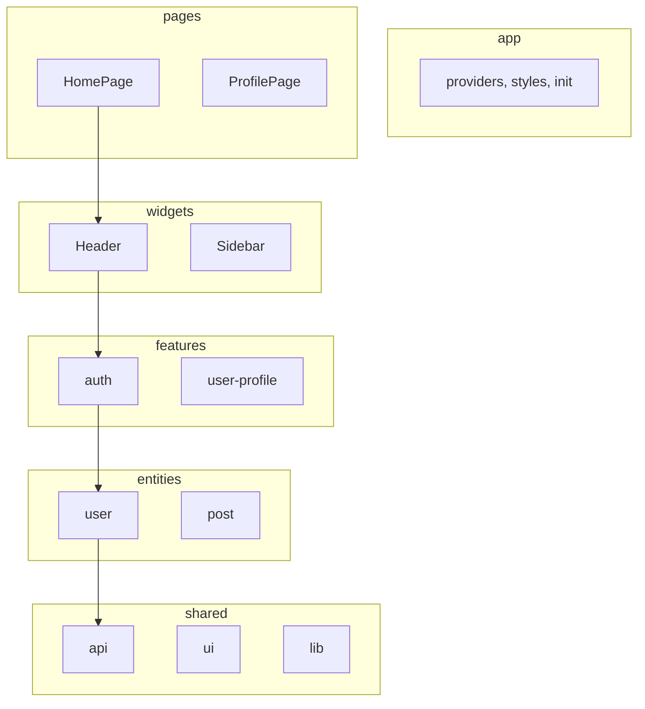

# Настройки Frontend Приложения

## Содержание

1. [Технологический стек](#технологический-стек)
2. [Архитектура](#архитектура)
3. [Структура проекта](#структура-проекта)
4. [Связанные документы](#связанные-документы)

---

## Технологический стек

**React 18-19** — [REACT.md](./REACT.md)

Библиотека для построения UI на основе функциональных компонентов и hooks. Используем Concurrent Features, Suspense для код-сплиттинга, Server Components где применимо.

**TypeScript 5+** — [TYPESCRIPT.md](./TYPESCRIPT.md)

Статическая типизация с strict mode. Интерфейсы для props, generics для hooks и utils, discriminated unions для state management.

**Redux Toolkit + RTK Query** — [REDUX.md](./REDUX.md)

Глобальное состояние и кэширование серверных данных. Slices для domain state, RTK Query для API requests с автоматическим кэшированием.

**React Router 6** — [ROUTING.md](./ROUTING.md)

Декларативный роутинг с data loaders, lazy loading routes. Outlet для nested routes, useNavigate для программной навигации.

**MUI 7 (Material UI)** — [MUI.md](./MUI.md)

Компонентная библиотека с готовой дизайн-системой. Темизация через ThemeProvider, кастомизация sx prop и styled API.

**Testing** — [TESTING.md](./TESTING.md)

Jest + React Testing Library для unit тестов компонентов и hooks. Playwright для e2e тестирования критических пользовательских сценариев.

**Webpack 5** — [WEBPACK.md](./WEBPACK.md)

Сборка с code splitting, tree shaking, hot module replacement. Оптимизация для production: минификация, gzip, lazy loading chunks.

---

## Архитектура

**Feature-Sliced Design (FSD)** — [FSD.md](./FSD.md)

Архитектурная методология разбиения приложения по фичам. Слои: app, processes, pages, widgets, features, entities, shared. Каждая фича изолирована и содержит всё необходимое.



---

## Структура проекта

```
frontend/
├── src/
│   ├── app/                    # Инициализация приложения
│   │   ├── providers/          # Композиция провайдеров
│   │   ├── styles/             # Глобальные стили
│   │   └── index.tsx           # Точка входа
│   ├── pages/                  # Страницы приложения
│   │   ├── home/
│   │   └── profile/
│   ├── widgets/                # Самостоятельные блоки UI
│   │   ├── header/
│   │   └── sidebar/
│   ├── features/               # Фичи (user interactions)
│   │   ├── auth/
│   │   └── create-post/
│   ├── entities/               # Бизнес-сущности
│   │   ├── user/
│   │   └── post/
│   └── shared/                 # Переиспользуемый код
│       ├── api/                # RTK Query API
│       ├── ui/                 # UI-kit компоненты
│       ├── lib/                # Хелперы и утилиты
│       └── config/             # Конфигурация
├── public/
├── tests/
│   ├── unit/                   # Jest + RTL
│   └── e2e/                    # Playwright
├── webpack.config.js
├── tsconfig.json
└── package.json
```

---

## Связанные документы

### Core Technologies
- [REACT.md](./REACT.md) — React 18-19, Hooks, Patterns
- [TYPESCRIPT.md](./TYPESCRIPT.md) — Типизация, Strict Mode, Best Practices
- [REDUX.md](./REDUX.md) — Redux Toolkit, RTK Query, State Management

### Infrastructure
- [ROUTING.md](./ROUTING.md) — React Router 6, Data Loaders, Lazy Loading
- [MUI.md](./MUI.md) — Material UI 7, Theming, Components
- [WEBPACK.md](./WEBPACK.md) — Сборка, Code Splitting, Оптимизация

### Quality
- [TESTING.md](./TESTING.md) — Jest, React Testing Library, Playwright
- [FSD.md](./FSD.md) — Feature-Sliced Design Architecture
