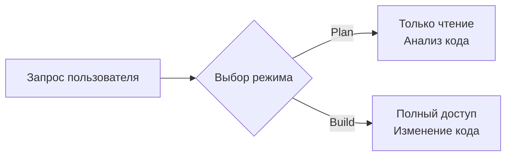
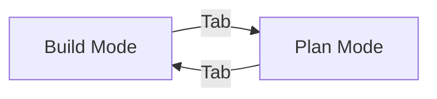
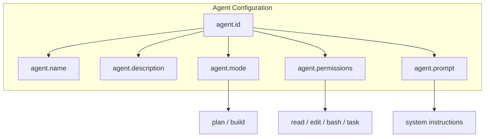

# Agents

## Содержание

1. [Архитектура Agent System](#архитектура-agent-system)
2. [Режимы работы](#режимы-работы)
3. [Plan Mode](#plan-mode)
4. [Build Mode](#build-mode)
5. [Конфигурация агентов](#конфигурация-агентов)
6. [System Prompt](#system-prompt)
7. [Переключение режимов](#переключение-режимов)
8. [Создание кастомных агентов](#создание-кастомных-агентов)

---

## Архитектура Agent System

Agent System — это мозг OpenCode. Он решает, как агент будет работать с вашим кодом: только смотреть (Plan) или изменять (Build).

Агент — это настройка поведения ИИ. Не путайте с пользователем или программой. Это "роль", которую ИИ играет при работе с вашим проектом.

```
Пользователь → Выбирает агента → OpenCode применяет настройки → ИИ работает в заданном режиме
```

Каждый агент содержит:
- **System Prompt** — инструкции для ИИ (что делать, чего не делать)
- **Permissions** — разрешения на инструменты (read, write, bash)
- **Mode** — режим работы (plan или build)

---

## Режимы работы

OpenCode имеет два базовых режима. Они определяют, может ли агент изменять ваш код.



**Plan Mode** — "Смотри, но не трогай". Агент анализирует код, даёт рекомендации, но не может изменить файлы.

**Build Mode** — "Делай всё что нужно". Агент может читать, писать, редактировать файлы, запускать команды.

---

## Plan Mode

Plan Mode — безопасный режим для анализа. Используйте, когда хотите понять код, не рискуя его сломать.

**Что можно:**
- Читать файлы (read)
- Искать в коде (grep, glob)
- Запрашивать разрешение на bash-команды

**Что нельзя:**
- Редактировать файлы
- Создавать новые файлы
- Запускать команды без спроса

**Когда использовать:**
- Изучение чужого кода
- Code review
- Архитектурный анализ
- Планирование рефакторинга

```
User: Объясни, как работает эта функция?
Agent [Plan]: *читает код* → *объясняет логику* → не меняет файлы
```

---

## Build Mode

Build Mode — рабочий режим для разработки. Агент ведёт себя как опытный разработчик с полным доступом.

**Что можно:**
- Всё из Plan Mode
- Редактировать файлы (edit)
- Создавать файлы (write)
- Запускать команды (bash)
- Создавать subagents

**Когда использовать:**
- Написание нового кода
- Исправление багов
- Рефакторинг
- Настройка проекта

```
User: Добавь новую функцию
Agent [Build]: *читает код* → *создаёт файлы* → *редактирует существующие* → *запускает тесты*
```

---

## Конфигурация агентов

Агенты настраиваются в файле `opencode.json`. Вы можете изменить существующих или создать своих.

**Структура конфигурации:**

```
agent/
├── id          — уникальное имя агента
├── name        — отображаемое имя
├── description — описание для ИИ
├── mode        — plan или build
└── permissions — что агент может делать
```

**Права доступа (permissions):**
- `read` — чтение файлов (allow/deny/ask)
- `edit` — редактирование (allow/deny/ask)
- `bash` — shell команды (allow/deny/ask)
- `task` — создание subagents (allow/deny/ask)

`allow` — разрешено без вопросов
`deny` — запрещено
`ask` — спрашивать разрешение

---

## System Prompt

System Prompt — это инструкция для ИИ, которую она видит перед каждым диалогом. Она задаёт "личность" агента.

**Что содержит prompt:**
- Кто агент (разработчик, архитектор, тестировщик)
- Что делать (писать код, ревьюить, тестировать)
- Чего не делать (не менять без разрешения, не использовать опасные команды)
- Особенности проекта (стек, conventions)

**Пример структуры:**
```
Ты — опытный backend-разработчик.
Твоя задача — писать чистый TypeScript код.
Всегда используй strict mode.
Прежде чем редактировать, читай существующий код.
Запускай тесты после изменений.
```

---

## Переключение режимов

Вы можете переключать агентов прямо во время работы.

**Способы переключения:**

1. **Через TUI** — клавиша Tab для переключения между Build/Plan
2. **Через команду** — `/mode plan` или `/mode build`
3. **Через конфиг** — изменение `opencode.json` и перезапуск

**Когда переключаться:**
- Начинаете задачу → Build
- Хотите проверить чужой код → Plan
- Нужен совет по архитектуре → Plan
- Готовы внедрять изменения → Build



---

## Создание кастомных агентов

Помимо встроенных Build и Plan, вы можете создавать специализированных агентов для конкретных задач.

### Зачем создавать агентов?

**Специализация** — агент знает свою роль и не отвлекается на другое.

**Безопасность** — ограничиваете права (reviewer только читает, не пишет).

**Эффективность** — не тратите токены на общие инструкции каждый раз.

### Пример 1: Architect (Архитектор)

Архитектор анализирует структуру проекта и предлагает улучшения. Он не пишет код, а думает о высокоуровневой организации.

**Назначение:**
- Проектирование структуры проекта
- Выбор технологий
- Определение границ модулей
- Code review архитектуры

**Особенности:**
- Режим: Plan (только анализ)
- Права: только read (не может менять код)
- Фокус: паттерны, зависимости, масштабируемость

**Когда использовать:**
- Начало нового проекта
- Планирование рефакторинга
- Оценка технического долга

### Пример 2: Code Reviewer

Ревьювер проверяет качество кода перед merge. Он находит баги, code smells, нарушения стандартов.

**Назначение:**
- Проверка pull request
- Поиск багов
- Проверка стиля кода
- Анализ безопасности

**Особенности:**
- Режим: Plan (только чтение)
- Права: read + grep (может искать по всему коду)
- Фокус: качество, баги, best practices

**Когда использовать:**
- Перед коммитом
- В CI/CD pipeline
- Для обучения junior разработчиков

### Пример 3: Tester (Тестировщик)

Тестировщик создаёт и запускает тесты. Он проверяет, что код работает корректно.

**Назначение:**
- Написание unit-тестов
- Написание интеграционных тестов
- Покрытие кода тестами
- Запуск тестовых сценариев

**Особенности:**
- Режим: Build (создаёт файлы тестов)
- Права: read + write + bash (запускает тесты)
- Фокус: coverage, edge cases, asserts

**Когда использовать:**
- После написания функции
- При работе с legacy кодом
- Для TDD разработки

### Структура кастомного агента



### Как добавить агента

1. Создать или отредактировать `opencode.json`
2. Добавить объект в секцию `agent`
3. Указать уникальный ID
4. Настроить права доступа
5. Написать system prompt
6. Перезапустить OpenCode

Агент появится в списке доступных и его можно выбрать через Tab или команду `/agent`.
