# OpenCode Agent — Архитектура

## Содержание

1. [Обзор архитектуры](#обзор-архитектуры)
2. [Технологический стек](#технологический-стек)
3. [Модульная структура](#модульная-структура)
4. [Core Systems](#core-systems)
   - [Session Management](#session-management)
   - [Provider System](#provider-system)
   - [Tool System](#tool-system)
   - [Agent System](#agent-system)
5. [Поток выполнения](#поток-выполнения)
6. [Data Flow и Context Management](#data-flow-и-context-management)
7. [Примеры кода](#примеры-кода)

---

## Обзор архитектуры

OpenCode — это open-source AI coding agent с модульной архитектурой, построенный на принципе **агентного цикла** (agentic loop). Система интегрируется с 75+ AI-провайдерами и предоставляет единый интерфейс для выполнения задач по разработке ПО.

### Ключевые архитектурные принципы

1. **Модульность** — система разбита на изолированные пакеты с чёткими границами
2. **Провайдер-агностичность** — абстракция над различными LLM через AI SDK
3. **Tool-Centric** — взаимодействие с внешним миром через систему инструментов
4. **Event-Driven** — коммуникация между компонентами через Event Bus
5. **Client-Server** — возможность работы как CLI (TUI) и как HTTP-сервис

### Общая архитектурная диаграмма

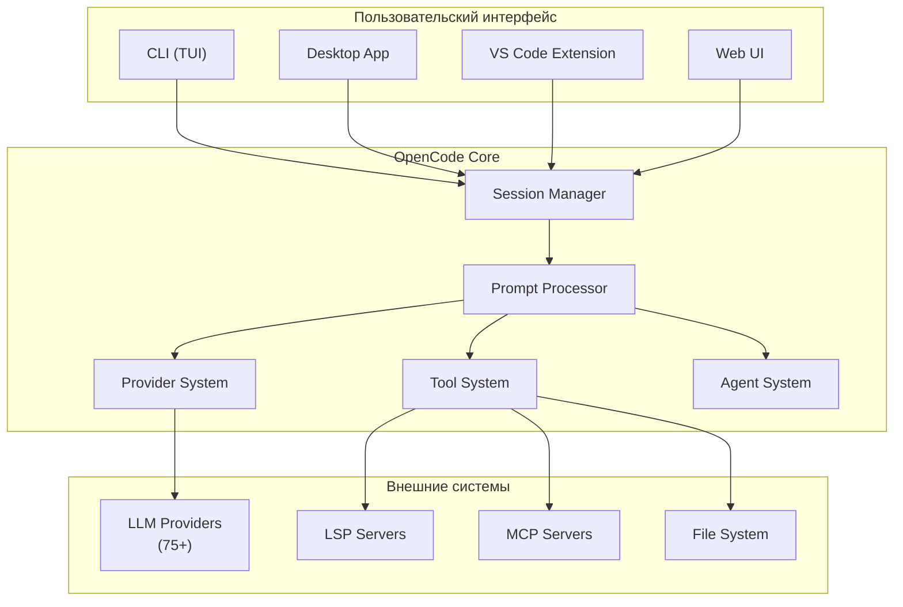

---

## Технологический стек

### Основные технологии

| Компонент | Технология | Версия | Назначение |
|-----------|------------|--------|------------|
| **Runtime** | Bun | Latest | Выполнение TypeScript, пакетный менеджер |
| **Язык** | TypeScript | 5.0+ | Типизация, разработка |
| **AI SDK** | Vercel AI SDK | Latest | Унифицированный интерфейс к LLM |
| **Валидация** | Zod | Latest | Схемы данных, валидация |
| **Веб-сервер** | Hono | 4.x | HTTP API, middleware |
| **Состояние** | Immer | Latest | Immutable state updates |
| **События** | EventEmitter3 | Latest | Event Bus |

### Базы данных и хранение

| Тип | Технология | Назначение |
|-----|------------|------------|
| **Векторная БД** | pgvector (PostgreSQL) | Semantic search, embeddings |
| **Кэш** | Redis | Сессии, провайдеры, модели |
| **Конфигурация** | TOML | Пользовательские настройки |
| **Файлы** | SQLite | Локальное хранилище сессий |

### Инфраструктура

| Компонент | Технология | Назначение |
|-----------|------------|------------|
| **Монорепозиторий** | Turborepo | Управление пакетами |
| **Сборка** | Bun bundler | Компиляция TypeScript |
| **Деплой** | SST / Cloudflare Workers | Serverless deployment |
| **CI/CD** | GitHub Actions | Автоматизация |

### Кодовая база

```
Языки распределения:
- TypeScript: 49.8%
- MDX: 46.2%
- CSS: 3.2%
- Rust: 0.3%
- Astro: 0.2%
```

---

## Модульная структура

OpenCode организован как монорепозиторий с использованием **Turborepo**. Каждый пакет имеет чёткую зону ответственности.

### Диаграмма модульной структуры

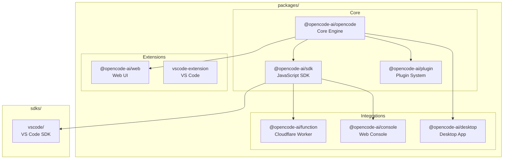

### Описание пакетов

#### @opencode-ai/opencode (Core)

**Назначение**: Ядро системы — сессии, инструменты, провайдеры, агенты.

**Ключевые модули**:
```
src/
├── session/          # Управление сессиями
│   ├── index.ts     # Session lifecycle
│   ├── prompt.ts    # Prompt processing loop
│   ├── llm.ts       # LLM interactions
│   ├── message.ts   # Message structures
│   └── compaction.ts # Context compaction
├── tool/            # Tool System
│   ├── registry.ts  # Tool registration
│   ├── tool.ts      # Tool definition
│   ├── bash.ts      # Bash execution
│   ├── read.ts      # File reading
│   ├── write.ts     # File writing
│   ├── edit.ts      # File editing
│   └── task.ts      # Subagent delegation
├── provider/        # Provider System
│   ├── provider.ts  # Provider management
│   ├── transform.ts # Message transformations
│   └── models.ts    # Model registry
├── agent/           # Agent System
│   ├── plan.ts      # Plan mode
│   ├── act.ts       # Act mode
│   └── subagent.ts  # Subagent management
├── config/          # Configuration
│   └── config.ts    # Config loading
├── server/          # HTTP Server
│   └── server.ts    # Hono server
└── bus/             # Event Bus
    └── bus-event.ts # Event definitions
```

**Пример кода — регистрация сессии**:

```typescript
// packages/opencode/src/session/index.ts
import { EventEmitter } from 'eventemitter3';
import { MessageV2 } from './message-v2';
import { Tool } from '../tool/tool';

export class Session extends EventEmitter {
  readonly id: string;
  readonly worktree: Worktree;
  readonly messages: MessageV2.Message[] = [];
  
  constructor(config: SessionConfig) {
    super();
    this.id = generateId();
    this.worktree = config.worktree;
  }

  async prompt(input: string, options?: PromptOptions): Promise<void> {
    // Добавляем сообщение пользователя
    const userMessage = MessageV2.user(input);
    this.messages.push(userMessage);
    
    // Запускаем agentic loop
    await this.runAgenticLoop(options);
  }

  private async runAgenticLoop(options?: PromptOptions): Promise<void> {
    let shouldContinue = true;
    
    while (shouldContinue) {
      // Получаем ответ от LLM
      const response = await this.callLLM();
      
      // Обрабатываем tool calls
      if (response.toolCalls) {
        for (const toolCall of response.toolCalls) {
          const result = await this.executeTool(toolCall);
          this.messages.push(MessageV2.toolResult(result));
        }
      }
      
      // Проверяем завершение
      shouldContinue = response.finishReason === 'tool-calls';
    }
  }
}
```

#### @opencode-ai/sdk

**Назначение**: JavaScript/TypeScript SDK для интеграции с OpenCode.

**Функции**:
- Создание сессий
- Отправка сообщений
- Подписка на события (SSE)
- Управление tools

**Пример использования**:

```typescript
import { OpenCode } from '@opencode-ai/sdk';

const client = new OpenCode({
  baseUrl: 'http://localhost:3000',
  apiKey: process.env.OPENCODE_API_KEY,
});

const session = await client.sessions.create({
  worktree: '/path/to/project',
});

// Отправляем сообщение
await session.prompt('Implement a new feature');

// Подписываемся на события
session.on('message.part.updated', (event) => {
  console.log('Tool execution:', event.part);
});
```

#### @opencode-ai/plugin

**Назначение**: Система плагинов для расширения функциональности.

**Жизненный цикл плагина**:

```typescript
// packages/plugin/src/plugin.ts
export interface Plugin {
  id: string;
  name: string;
  
  // Инициализация при загрузке
  init?: (ctx: PluginContext) => Promise<void>;
  
  // Регистрация tools
  registerTools?: (registry: ToolRegistry) => void;
  
  // Обработка событий
  onEvent?: (event: BusEvent) => void;
}
```

#### @opencode-ai/function

**Назначение**: Cloudflare Worker для интеграции с внешними сервисами.

**Технологии**:
- Hono 4.x
- Octokit (GitHub API)
- JWT (jose)

**Функции**:
- Обработка GitHub webhooks
- GitHub App authentication
- API endpoints для интеграций

#### @opencode-ai/console

**Назначение**: Web-консоль для управления сессиями и мониторинга.

**Стек**:
- Astro
- React
- SST (Serverless Stack)

#### @opencode-ai/desktop

**Назначение**: Desktop приложение (Electron/Tauri).

**Особенности**:
- Native OS integration
- System tray
- Global hotkeys
- Local file system access

---

## Core Systems

### Session Management

Session Management отвечает за жизненный цикл сессий взаимодействия с AI.

#### Жизненный цикл сессии

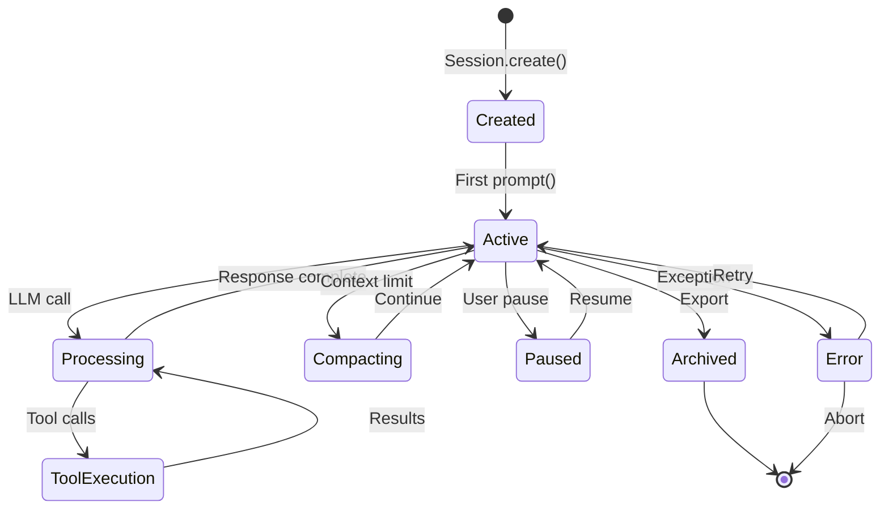

#### Структура сессии

```typescript
interface Session {
  // Идентификация
  id: string;
  createdAt: Date;
  
  // Контекст
  worktree: Worktree;        // Рабочая директория
  config: SessionConfig;     // Конфигурация
  
  // Состояние
  messages: MessageV2.Message[];
  state: 'active' | 'paused' | 'error';
  
  // Метаданные
  title?: string;
  summary?: string;
  tokenCount: number;
}
```

#### Prompt Processing Pipeline

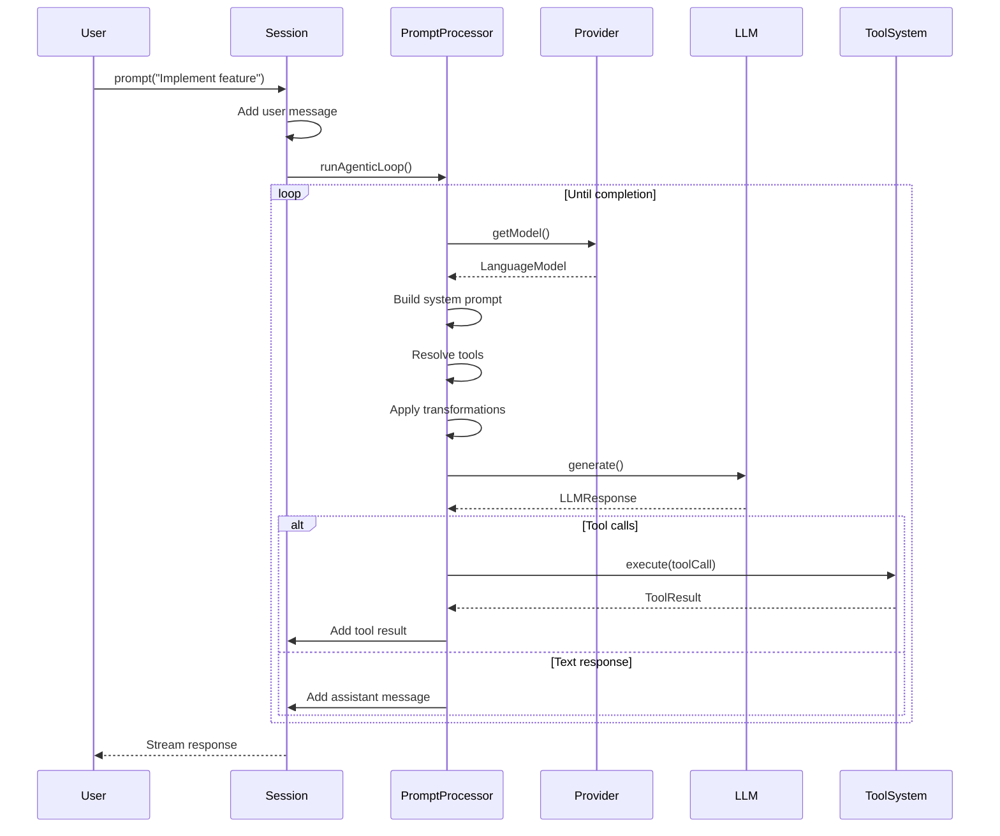

#### Context Management

Управление контекстом критически важно из-за ограничений LLM на размер контекста.

**Compaction (Сжатие)**:

```typescript
// packages/opencode/src/session/compaction.ts
export async function compactSession(
  session: Session,
  strategy: CompactionStrategy
): Promise<void> {
  // 1. Анализируем сообщения
  const analysis = analyzeMessages(session.messages);
  
  // 2. Группируем по темам
  const clusters = clusterMessages(analysis);
  
  // 3. Создаём summary для каждого кластера
  const summaries = await Promise.all(
    clusters.map(cluster => summarize(cluster))
  );
  
  // 4. Заменяем старые сообщения на summaries
  session.messages = [
    ...summaries,
    ...session.messages.slice(-10), // Последние 10 сообщений сохраняем
  ];
}
```

---

### Provider System

Provider System предоставляет абстракцию над 75+ AI-провайдерами.

#### Архитектура Provider System

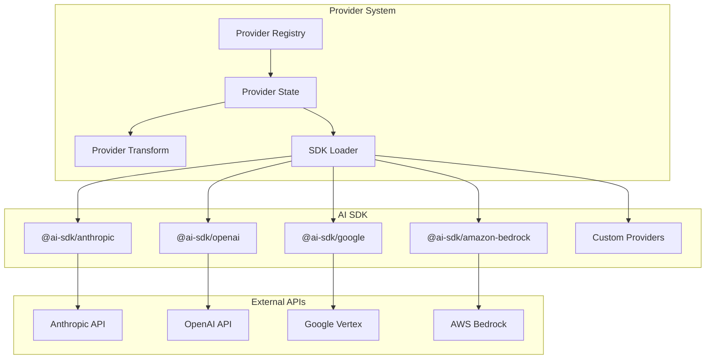

#### Provider State

```typescript
// packages/opencode/src/provider/provider.ts
interface ProviderState {
  // Карта доступных провайдеров
  providers: Map<string, ProviderInfo>;
  
  // Кэш моделей
  models: Map<string, LanguageModel>;
  
  // Кэш SDK (по хешу конфигурации)
  sdk: Map<number, SDK>;
  
  // Алиасы моделей
  realIdByKey: Map<string, string>;
}
```

#### Custom Loaders

```typescript
// Пример: Amazon Bedrock Loader
const bedrockLoader: CustomLoader = {
  id: 'amazon-bedrock',
  
  // Автоматическая загрузка при наличии AWS credentials
  autoload: () => {
    return !!(process.env.AWS_ACCESS_KEY_ID || process.env.AWS_PROFILE);
  },
  
  // Создание SDK с региональными префиксами
  createSDK: (options) => {
    const region = process.env.AWS_REGION || 'us-east-1';
    const prefix = getRegionPrefix(region);
    
    return new BedrockSDK({
      region,
      credentials: fromNodeProviderChain(),
      ...options,
    });
  },
  
  // Трансформация ID модели
  transformModelId: (id, region) => {
    const prefix = getRegionPrefix(region);
    return id.startsWith('global.') ? id : `${prefix}${id}`;
  },
};
```

#### Provider Transformations

Трансформации адаптируют запросы под специфические требования провайдеров:

```typescript
// packages/opencode/src/provider/transform.ts
export namespace ProviderTransform {
  // Нормализация tool call IDs (требование Claude)
  export function message(msg: Message): Message {
    if (isToolCall(msg)) {
      return {
        ...msg,
        toolCallId: msg.toolCallId.replace(/[^a-zA-Z0-9]/g, '_'),
      };
    }
    return msg;
  }
  
  // Prompt Caching для Anthropic
  export function applyCaching(messages: Message[]): Message[] {
    // Маркируем первые 2 системных сообщения
    // и последние 2 conversational сообщения
    return messages.map((msg, index) => {
      if (shouldCache(msg, index, messages.length)) {
        return {
          ...msg,
          providerOptions: {
            anthropic: {
              cacheControl: { type: 'ephemeral' },
            },
          },
        };
      }
      return msg;
    });
  }
  
  // Обработка reasoning content (DeepSeek)
  export function reasoningContent(msg: Message): Message {
    if (msg.reasoning_content) {
      return {
        ...msg,
        providerOptions: {
          ...msg.providerOptions,
          reasoning: msg.reasoning_content,
        },
      };
    }
    return msg;
  }
}
```

#### Поддерживаемые провайдеры

| Провайдер | Пакет | Модели |
|-----------|-------|--------|
| **Anthropic** | @ai-sdk/anthropic | Claude 3.5 Sonnet, Claude 3 Opus, Claude 3.5 Haiku |
| **OpenAI** | @ai-sdk/openai | GPT-4, GPT-4 Turbo, GPT-3.5 Turbo |
| **Google** | @ai-sdk/google | Gemini Pro, Gemini Pro Vision |
| **Azure** | @ai-sdk/azure | Azure OpenAI |
| **AWS Bedrock** | @ai-sdk/amazon-bedrock | Claude, Mistral, Llama |
| **Google Vertex** | @ai-sdk/google-vertex | Gemini via Vertex AI |
| **OpenRouter** | @openrouter/ai-sdk-provider | 200+ моделей |
| **GitHub Copilot** | @ai-sdk/github-copilot | Copilot models |

---

### Tool System

Tool System — это механизм, позволяющий AI-агенту взаимодействовать с внешним миром.

#### Архитектура Tool System

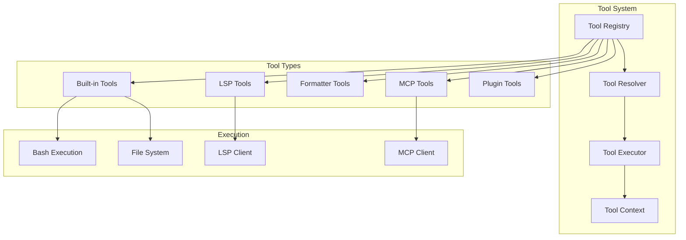

#### Определение Tool

```typescript
// packages/opencode/src/tool/tool.ts
export interface ToolDefinition<TParams = any, TResult = any> {
  // Уникальный идентификатор
  id: string;
  
  // Описание для AI модели
  description: string;
  
  // Zod схема параметров
  parameters: z.ZodObject<any>;
  
  // Функция выполнения
  execute: (params: TParams, context: ToolContext) => Promise<TResult>;
}

// Пример: Tool для чтения файлов
export const readTool = Tool.define({
  id: 'read',
  description: 'Read file contents from the filesystem',
  parameters: z.object({
    filePath: z.string().describe('Path to the file'),
    offset: z.number().optional().describe('Line offset to start reading'),
    limit: z.number().optional().describe('Number of lines to read'),
  }),
  execute: async (params, context) => {
    const content = await fs.readFile(
      path.join(context.worktree.path, params.filePath),
      'utf-8'
    );
    return { content };
  },
});
```

#### Tool Context

```typescript
interface ToolContext {
  // Рабочая директория
  worktree: Worktree;
  
  // Сессия
  session: Session;
  
  // Запрос разрешений
  ask: (permission: Permission) => Promise<boolean>;
  
  // Метаданные выполнения
  metadata: (data: Record<string, any>) => void;
  
  // Сигнал отмены
  abort: AbortSignal;
}
```

#### Жизненный цикл Tool Execution

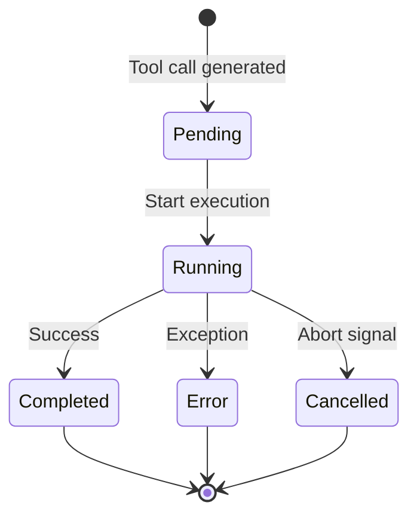

#### Built-in Tools

| Tool ID | Назначение | Параметры |
|---------|------------|-----------|
| **read** | Чтение файлов | `filePath`, `offset?`, `limit?` |
| **write** | Запись файлов | `filePath`, `content` |
| **edit** | Редактирование файлов | `filePath`, `oldString`, `newString` |
| **bash** | Выполнение shell команд | `command`, `workdir?`, `timeout?` |
| **task** | Делегирование subagent | `description`, `prompt` |
| **glob** | Поиск файлов по шаблону | `pattern`, `path?` |
| **grep** | Поиск в содержимом файлов | `pattern`, `path?`, `include?` |
| **list** | Список директории | `path` |

#### LSP Tools

```typescript
// packages/opencode/src/lsp/client.ts
export class LSPClient {
  // Подключение к Language Server
  async connect(languageId: string): Promise<void>;
  
  // Получение диагностик
  async getDiagnostics(filePath: string): Promise<Diagnostic[]>;
  
  // Поиск символов
  async getSymbols(filePath: string): Promise<Symbol[]>;
  
  // Go to definition
  async getDefinition(
    filePath: string,
    position: Position
  ): Promise<Location[]>;
  
  // Find references
  async getReferences(
    filePath: string,
    position: Position
  ): Promise<Location[]>;
}
```

#### MCP (Model Context Protocol)

```typescript
// packages/opencode/src/mcp/client.ts
export class MCPClient {
  // Подключение к MCP серверу
  async connect(config: MCPServerConfig): Promise<void>;
  
  // Получение списка tools
  async listTools(): Promise<MCPTool[]>;
  
  // Выполнение MCP tool
  async callTool(name: string, args: any): Promise<any>;
  
  // Получение ресурсов
  async readResource(uri: string): Promise<Resource>;
}
```

---

### Agent System

Agent System управляет режимами работы агента и делегированием задач subagents.

#### Режимы работы

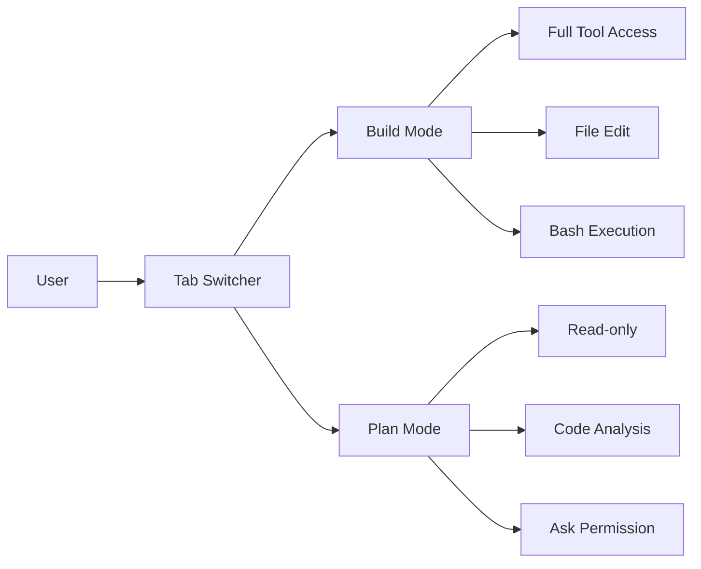

#### Build Mode

Режим полного доступа для разработки:

```typescript
// packages/opencode/src/agent/act.ts
export const buildMode: AgentMode = {
  id: 'build',
  name: 'Build',
  description: 'Full-access agent for development work',
  
  permissions: {
    read: 'allow',
    write: 'allow',
    edit: 'allow',
    bash: 'allow',
    task: 'allow',
  },
  
  systemPrompt: `You are OpenCode, an AI coding assistant.
You have full access to the codebase and can make changes.
Always follow the user's instructions precisely.`,
};
```

#### Plan Mode

Режим только для чтения и анализа:

```typescript
// packages/opencode/src/agent/plan.ts
export const planMode: AgentMode = {
  id: 'plan',
  name: 'Plan',
  description: 'Read-only agent for analysis and planning',
  
  permissions: {
    read: 'allow',
    write: 'deny',  // Запрещено
    edit: 'deny',   // Запрещено
    bash: 'ask',    // Спрашивать разрешение
    task: 'deny',
  },
  
  systemPrompt: `You are OpenCode in Plan Mode.
You can only READ and ANALYZE code.
DO NOT make any changes to files.
If you need to run commands, ask for permission.`,
};
```

#### Subagent System

```typescript
// packages/opencode/src/tool/task.ts
export const taskTool = Tool.define({
  id: 'task',
  description: 'Delegate a task to a subagent',
  parameters: z.object({
    description: z.string().describe('Short task description'),
    prompt: z.string().describe('Detailed instructions for subagent'),
  }),
  execute: async (params, context) => {
    // Создаём subagent
    const subagent = await createSubagent({
      parentSession: context.session,
      description: params.description,
    });
    
    // Делегируем задачу
    const result = await subagent.run(params.prompt);
    
    // Возвращаем результат родителю
    return {
      summary: result.summary,
      changes: result.changes,
      files: result.affectedFiles,
    };
  },
});
```

#### Permission System

```typescript
// packages/opencode/src/permission/next.ts
export interface PermissionRule {
  // Паттерн (glob)
  pattern: string;
  
  // Действие
  action: 'allow' | 'deny' | 'ask';
  
  // Приоритет (чем выше, тем важнее)
  priority: number;
}

export class PermissionEvaluator {
  evaluate(toolId: string, params: any): PermissionResult {
    // Ищем подходящее правило
    const rule = this.findMatchingRule(toolId, params);
    
    if (!rule || rule.action === 'ask') {
      return { type: 'ask', toolId, params };
    }
    
    return { type: rule.action };
  }
}
```

---

## Поток выполнения

### Полный цикл обработки запроса

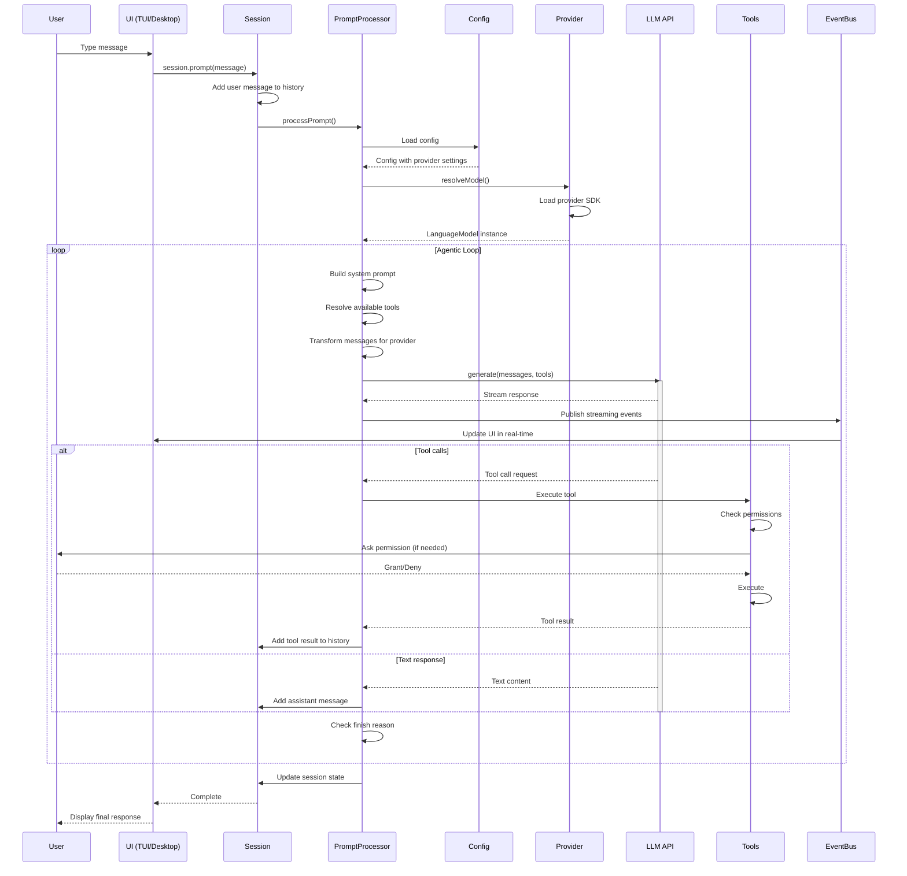

### Event Flow

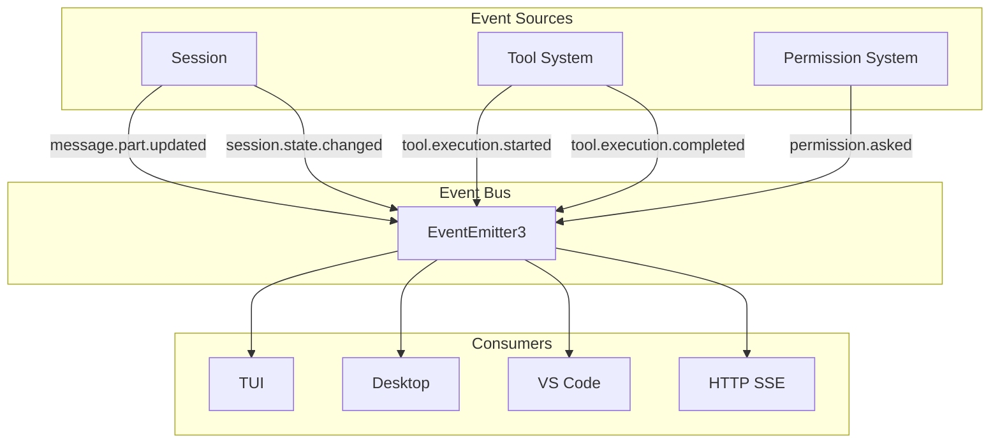

---

## Data Flow и Context Management

### Структура сообщений

```typescript
// packages/opencode/src/session/message-v2.ts
namespace MessageV2 {
  // Типы сообщений
  export type Message = 
    | UserMessage
    | AssistantMessage
    | ToolPart;
  
  // Сообщение пользователя
  export interface UserMessage {
    type: 'user';
    content: string;
    timestamp: Date;
  }
  
  // Сообщение ассистента
  export interface AssistantMessage {
    type: 'assistant';
    content: string;
    toolCalls?: ToolCall[];
    timestamp: Date;
  }
  
  // Tool execution
  export interface ToolPart {
    type: 'tool';
    toolCallId: string;
    toolName: string;
    input: any;
    output?: any;
    error?: string;
    state: 'pending' | 'running' | 'completed' | 'error';
    metadata?: Record<string, any>;
    time?: {
      start?: Date;
      end?: Date;
    };
  }
}
```

### Context Compaction

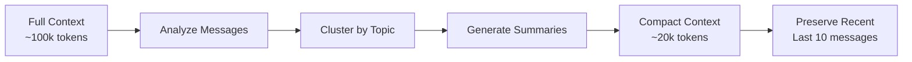

```typescript
// packages/opencode/src/session/compaction.ts
export async function compactContext(
  messages: MessageV2.Message[],
  targetTokens: number
): Promise<MessageV2.Message[]> {
  const currentTokens = estimateTokens(messages);
  
  if (currentTokens <= targetTokens) {
    return messages;
  }
  
  // 1. Разделяем на кластеры
  const clusters = clusterMessages(messages, {
    algorithm: 'semantic',
    minClusterSize: 3,
  });
  
  // 2. Создаём summary для каждого кластера
  const summaries = await Promise.all(
    clusters.map(async (cluster) => ({
      type: 'summary' as const,
      content: await generateSummary(cluster),
      originalMessageCount: cluster.length,
    }))
  );
  
  // 3. Сохраняем последние сообщения полностью
  const recentMessages = messages.slice(-10);
  
  // 4. Комбинируем
  return [...summaries, ...recentMessages];
}
```

### Token Management

```typescript
interface TokenBudget {
  // Максимальный размер контекста
  contextWindow: number;
  
  // Резерв для output
  outputReserve: number;
  
  // Резерв для tool calls
  toolReserve: number;
  
  // Доступно для input
  get availableForInput(): number {
    return this.contextWindow - this.outputReserve - this.toolReserve;
  }
}

// Пример бюджетов для разных моделей
const budgets: Record<string, TokenBudget> = {
  'claude-3-5-sonnet': {
    contextWindow: 200_000,
    outputReserve: 8_192,
    toolReserve: 4_000,
  },
  'gpt-4': {
    contextWindow: 128_000,
    outputReserve: 4_096,
    toolReserve: 2_000,
  },
};
```

---

## Примеры кода

### Создание кастомного Tool

```typescript
// tools/myTool.ts
import { Tool } from '@opencode-ai/opencode';
import { z } from 'zod';

export const myTool = Tool.define({
  id: 'my_custom_tool',
  description: 'Does something useful',
  
  parameters: z.object({
    input: z.string().describe('Input data'),
    option: z.enum(['a', 'b']).optional(),
  }),
  
  execute: async (params, context) => {
    // Проверяем разрешения
    const allowed = await context.ask({
      tool: 'my_custom_tool',
      action: 'execute',
      params,
    });
    
    if (!allowed) {
      throw new Error('Permission denied');
    }
    
    // Выполняем логику
    const result = await doSomething(params);
    
    // Обновляем метаданные
    context.metadata({
      executionTime: Date.now() - startTime,
      resultSize: JSON.stringify(result).length,
    });
    
    return result;
  },
});

// Регистрация в plugin
export const myPlugin = {
  id: 'my-plugin',
  
  init: async (ctx) => {
    ctx.registry.register(myTool);
  },
};
```

### Создание Subagent

```typescript
// agents/analyzer.ts
import { createSubagent } from '@opencode-ai/opencode';

export async function analyzeCodebase(
  parentSession: Session,
  targetPath: string
): Promise<AnalysisResult> {
  const subagent = await createSubagent({
    parentSession,
    mode: 'plan',  // Read-only mode
    description: 'Codebase analyzer',
  });
  
  const result = await subagent.run(`
    Analyze the codebase at ${targetPath}.
    Focus on:
    1. Architecture patterns
    2. Dependencies
    3. Potential issues
    
    Return a structured analysis.
  `);
  
  return {
    summary: result.summary,
    patterns: result.data.patterns,
    issues: result.data.issues,
  };
}
```

### Конфигурация Provider

```typescript
// opencode.json
{
  "provider": {
    "anthropic": {
      "apiKey": "${ANTHROPIC_API_KEY}",
      "models": {
        "my-claude": {
          "id": "claude-3-5-sonnet-20241022"
        }
      }
    },
    "openai": {
      "disabled": false,
      "models": {
        "gpt-4-turbo": {
          "id": "gpt-4-turbo-preview"
        }
      }
    },
    "disabled_providers": ["azure"],
    "enabled_providers": null  // null = all enabled
  },
  "model": "claude-3-5-sonnet",
  "small_model": "claude-3-5-haiku"
}
```

### Event Handling

```typescript
// Подписка на события
session.on('message.part.updated', (event) => {
  if (event.part.type === 'tool') {
    console.log(`Tool ${event.part.toolName}: ${event.part.state}`);
  }
});

session.on('permission.asked', async (event) => {
  // Показываем UI для подтверждения
  const allowed = await showPermissionDialog(event);
  
  // Отправляем ответ
  session.respondToPermission(event.id, allowed);
});

// Публикация событий
import { bus } from '@opencode-ai/opencode';

bus.emit('custom.event', {
  type: 'custom.event',
  data: { foo: 'bar' },
});
```

### Middleware для Provider

```typescript
// provider/middleware.ts
import { LanguageModel } from 'ai';

export function loggingMiddleware(
  model: LanguageModel
): LanguageModel {
  return {
    ...model,
    
    async doGenerate(options) {
      console.log('Generating with:', options.modelId);
      const startTime = Date.now();
      
      const result = await model.doGenerate(options);
      
      console.log('Generation took:', Date.now() - startTime, 'ms');
      console.log('Tokens used:', result.usage);
      
      return result;
    },
    
    async doStream(options) {
      console.log('Streaming with:', options.modelId);
      
      const stream = await model.doStream(options);
      
      return {
        ...stream,
        async *[Symbol.asyncIterator]() {
          for await (const chunk of stream) {
            console.log('Chunk:', chunk.type);
            yield chunk;
          }
        },
      };
    },
  };
}
```

---

## Заключение

OpenCode представляет собой мощную архитектуру с чётким разделением ответственности:

1. **Session Management** — жизненный цикл взаимодействия
2. **Provider System** — абстракция над 75+ LLM
3. **Tool System** — расширяемый механизм взаимодействия
4. **Agent System** — режимы работы и делегирование

Ключевые архитектурные решения:
- **Event-driven** коммуникация между компонентами
- **Lazy loading** провайдеров и SDK
- **Permission-based** доступ к инструментам
- **Provider-agnostic** через AI SDK
- **Modular** монорепозиторий

Эта архитектура обеспечивает гибкость, расширяемость и надёжность системы.
