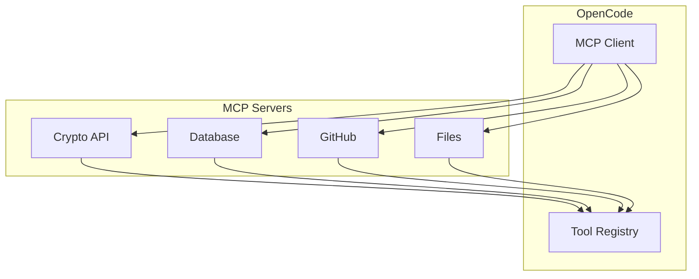
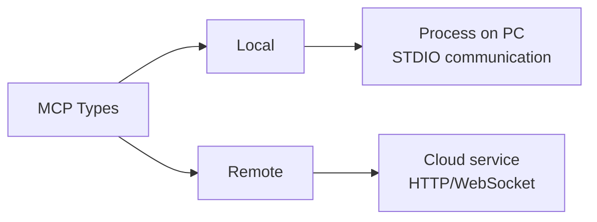
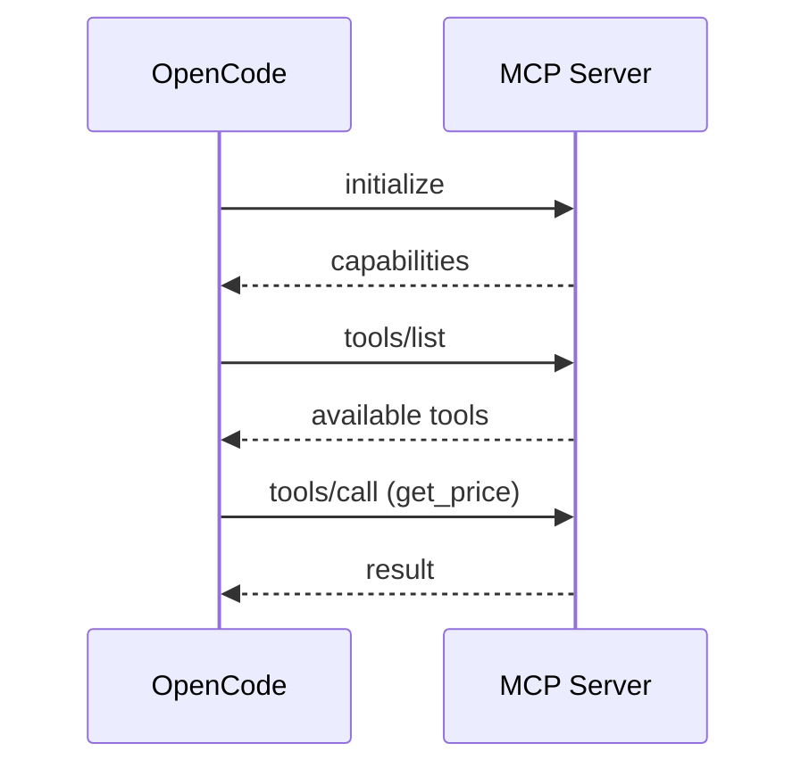
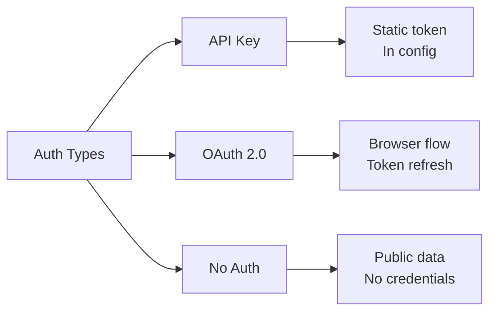

# MCP (Model Context Protocol)

## Содержание

1. [Архитектура MCP](#архитектура-mcp)
2. [Типы MCP серверов](#типы-mcp-серверов)
3. [Протокол коммуникации](#протокол-коммуникации)
4. [Регистрация tools](#регистрация-tools)
5. [Управление ресурсами](#управление-ресурсами)
6. [Аутентификация](#аутентификация)
7. [Интеграция с OpenCode](#интеграция-с-opencode)

---

## Архитектура MCP

MCP (Model Context Protocol) — это способ подключить внешние сервисы к OpenCode без написания кода.

Представьте, что OpenCode — это смартфон, а MCP серверы — это приложения из App Store. Вы устанавливаете их и получаете новые возможности.



MCP стандартизирует общение между ИИ и внешним миром. Вместо того чтобы писать интеграцию с API самому, вы подключаете готовый MCP сервер.

---

## Типы MCP серверов

Есть два способа подключения MCP серверов: локальный и удалённый.

**Local MCP** — программа запускается на вашем компьютере.
- Работает как отдельный процесс
- Общается через STDIO (pipes)
- Примеры: базы данных, файловые системы, локальные API

**Remote MCP** — сервер работает в интернете.
- Подключается через HTTP/WebSocket
- Требует сетевого доступа
- Примеры: облачные сервисы, SaaS API



**Когда какой использовать:**
- Локальный — для работы с локальными данными (файлы, БД)
- Удалённый — для интеграции с облачными сервисами (GitHub, Slack)

---

## Протокол коммуникации

MCP использует JSON-RPC для обмена сообщениями. Это стандартный формат запросов и ответов.

**Типы сообщений:**

**Initialize** — рукопожатие при подключении. Клиент и сервер договариваются о версии протокола и возможностях.

**Tools/List** — получение списка доступных инструментов от сервера.

**Tools/Call** — вызов конкретного инструмента с параметрами.

**Resources/Read** — чтение ресурса (файла, записи БД).

**Notifications** — асинхронные события от сервера.



---

## Регистрация tools

Когда MCP сервер подключается, он регистрирует свои tools в OpenCode.

**Процесс регистрации:**

1. OpenCode запускает MCP сервер (или подключается к remote)
2. Сервер отправляет список доступных tools
3. Каждый tool получает уникальное имя: `serverName/toolName`
4. Tools появляются в Tool Registry рядом со встроенными

**Примеры имён:**
- `crypto-price/getPrice`
- `github/createIssue`
- `postgres/query`

**Использование:**
```
ИИ видит tool в списке → генерирует вызов → OpenCode отправляет в MCP сервер → сервер выполняет → возвращает результат
```

---

## Управление ресурсами

Помимо tools, MCP серверы могут предоставлять ресурсы — данные, которые ИИ может читать.

**Что такое ресурс:**
- Файл в файловой системе
- Запись в базе данных
- Документ из API
- Любые данные с URI

**URI схемы:**
- `file:///path/to/file` — локальные файлы
- `postgres://table/row` — данные БД
- `github://repo/issue/123` — данные GitHub

**Жизненный цикл:**
1. MCP сервер объявляет доступные ресурсы
2. ИИ запрашивает чтение ресурса
3. OpenCode получает данные
4. Данные добавляются в контекст разговора

---

## Аутентификация

MCP серверы часто требуют аутентификации для доступа к данным.

**Типы аутентификации:**

**1. API Key**
Простой ключ передаётся в заголовках. Настраивается в конфигурации.

**2. OAuth 2.0**
Стандартный протокол для доступа к пользовательским данным. Поддерживает:
- Авторизацию через браузер
- Автоматическое обновление токенов
- Динамическую регистрацию клиентов

**3. No Auth**
Публичные API без аутентификации (например, публичные эндпоинты CoinGecko).



---

## Интеграция с OpenCode

Подключение MCP сервера к OpenCode происходит через конфигурацию.

**Структура конфигурации:**

```json
{
  "mcp": {
    "server-name": {
      "type": "local" | "remote",
      "command": [...],
      "environment": {...},
      "enabled": true | false
    }
  }
}
```

**Что происходит при старте:**

1. OpenCode читает `opencode.json`
2. Находит секцию `mcp`
3. Для каждого enabled сервера:
   - Запускает процесс (local) или подключается (remote)
   - Выполняет initialize handshake
   - Получает список tools
   - Регистрирует tools в системе

**Управление:**
- Вкл/выкл через `enabled: true/false`
- Права доступа через `permission` (как у обычных tools)
- Мониторинг статуса через API

**Практические примеры использования MCP:**

**Crypto Price:**
Подключаете `mcp-crypto-price` → ИИ может спрашивать "Сколько стоит Bitcoin?" → сервер возвращает актуальную цену.

**Database:**
Подключаете `postgres-mcp` → ИИ может выполнять "Покажи всех пользователей с email@gmail.com" → сервер выполняет SQL запрос.

**GitHub:**
Подключаете `github-mcp` → ИИ создаёт issues, читает PR, комментирует код прямо из OpenCode.

**Преимущества MCP:**
- Не пишете интеграцию с нуля
- Используете готовые решения сообщества
- Стандартизированный интерфейс
- Легко переключаться между серверами

**Ограничения:**
- Зависимость от внешнего кода
- Может требовать API ключи
- Добавляет задержку при вызове
- Не всегда гибкий под кастомные задачи
