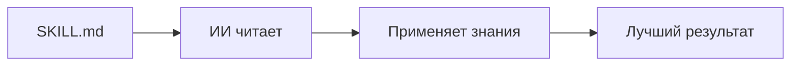
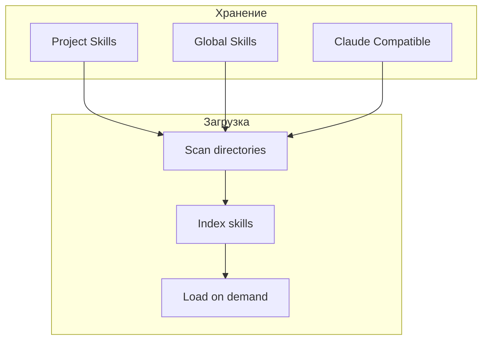
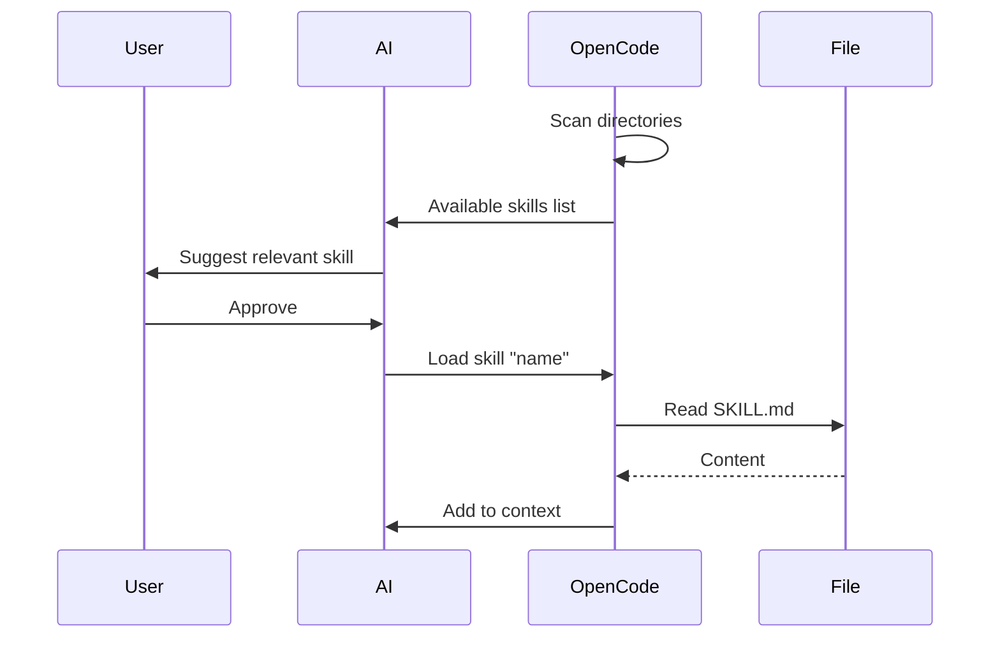
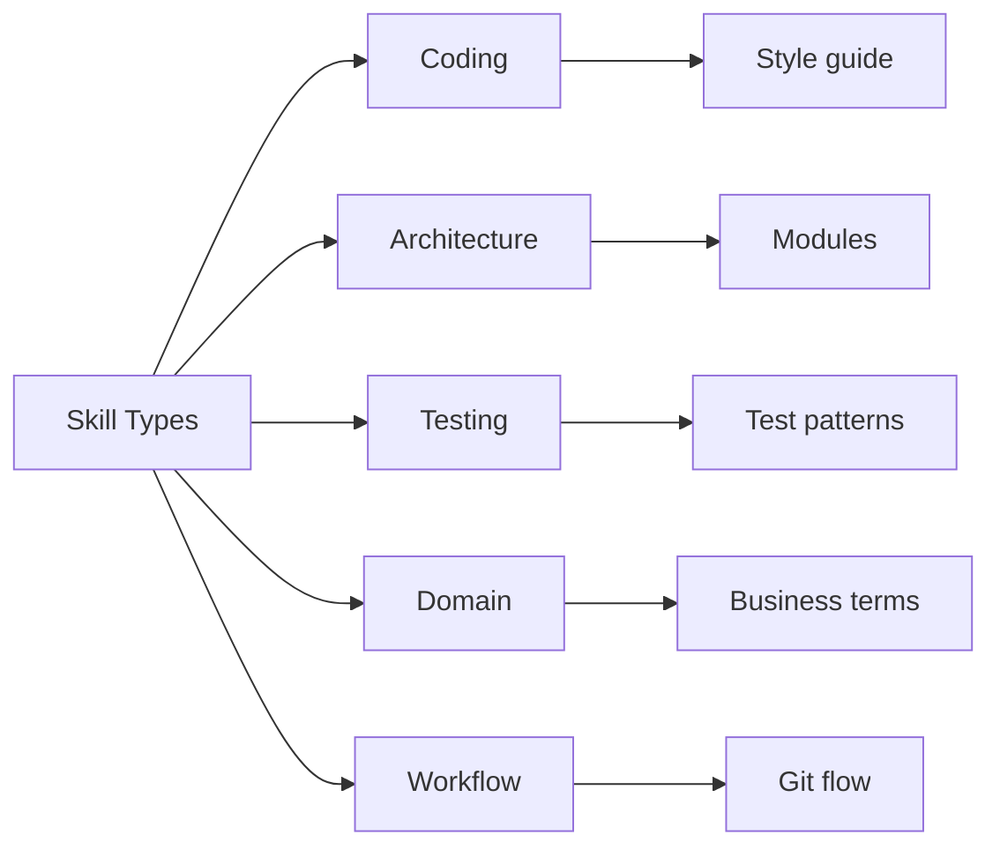
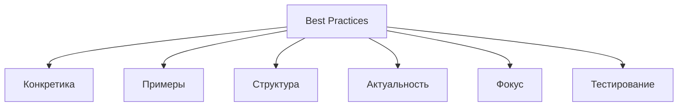

# Skills (Agent Skills)

## Содержание

1. [Что такое Skills](#что-такое-skills)
2. [Архитектура Skills](#архитектура-skills)
3. [Структура SKILL.md](#структура-skillmd)
4. [Обнаружение и загрузка](#обнаружение-и-загрузка)
5. [Типы Skills](#типы-skills)
6. [Взаимодействие с LLM](#взаимодействие-с-llm)
7. [Лучшие практики](#лучшие-практики)

---

## Что такое Skills

Skills — это инструкции для ИИ, написанные на естественном языке. Они расширяют знания агента о том, как работать с вашим проектом.

Представьте, что вы нанимаете нового разработчика. Вы даёте ему документацию: правила оформления кода, архитектуру проекта, особенности бизнес-логики. Skills — это такая документация для ИИ.

**Зачем нужны Skills:**
- Обучить агента специфике проекта
- Добавить контекст, которого нет в коде
- Стандартизировать подход к задачам
- Сохранить знания между сессиями



---

## Архитектура Skills

Skills хранятся в текстовых файлах SKILL.md и загружаются по требованию.

**Где хранятся:**
- `.opencode/skills/<name>/SKILL.md` — для конкретного проекта
- `~/.config/opencode/skills/<name>/SKILL.md` — глобально для всех проектов
- Также поддерживаются `.claude/skills/` и `.agents/skills/`

**Как работает:**

1. OpenCode сканирует директории skills при старте
2. Находит все SKILL.md файлы
3. Создаёт индекс доступных skills
4. При вызове — загружает содержимое в контекст



---

## Структура SKILL.md

SKILL.md — это markdown файл с инструкциями. Структура свободная, но есть рекомендации.

**Обязательные элементы:**
- Заголовок — что умеет этот skill
- Описание — когда использовать
- Инструкции — пошаговые шаги
- Примеры — как применять

**Пример структуры:**
```markdown
# Название Skill

## Когда использовать
Описание ситуаций для применения.

## Подход
1. Первый шаг
2. Второй шаг
3. Третий шаг

## Примеры
Пример применения skill.

## Ограничения
Что skill не умеет делать.
```

**Важно:**
- Пишите чётко и структурированно
- Используйте markdown (заголовки, списки)
- Давайте конкретные инструкции, не абстракции
- Включайте примеры из реального проекта

---

## Обнаружение и загрузка

OpenCode находит skills автоматически и загружает их по требованию.

**Поиск skills:**

OpenCode проходит по директориям в порядке приоритета:
1. Текущая директория → вверх до git root
2. `.opencode/skills/`
3. `.claude/skills/`
4. `.agents/skills/`
5. Глобальные `~/.config/opencode/skills/`

**Загрузка:**

Skills не загружаются автоматически при старте. ИИ видит список доступных skills и может запросить загрузку конкретного.

```
ИИ: "Я вижу skill 'testing-guide'. Загрузить?"
Пользователь: "Да"
OpenCode: *читает SKILL.md* → *добавляет в контекст*
```



---

## Типы Skills

Skills можно разделить на категории по назначению.

**1. Coding Standards**
Правила написания кода: стиль, naming conventions, структура файлов.

**2. Architecture**
Описание архитектуры проекта: модули, зависимости, паттерны.

**3. Testing**
Подход к тестированию: как писать тесты, что покрывать, инструменты.

**4. Domain Knowledge**
Бизнес-логика: термины, процессы, правила предметной области.

**5. Workflow**
Процессы разработки: code review, git workflow, CI/CD.



---

## Взаимодействие с LLM

Skills влияют на то, как ИИ отвечает на запросы.

**Как skills попадают в контекст:**

1. ИИ видит список доступных skills
2. При релевантном запросе предлагает загрузить
3. После загрузки — содержимое SKILL.md добавляется в system prompt
4. ИИ следует инструкциям из skill

**Пример:**

```
Запрос: "Напиши тест для этой функции"

Без skill:
ИИ пишет стандартный тест

С skill "testing-guide":
ИИ пишет тест следуя проектным правилам:
- Использует describe/it структуру
- Мокает внешние зависимости
- Проверяет edge cases
- Следует AAA pattern
```

**Когда использовать skills:**
- Стандартный подход не работает
- Есть специфические требования
- Нужно передать много контекста
- Хотите стандартизировать работу ИИ

---

## Лучшие практики

**1. Пишите конкретно**
Плохо: "Пиши хороший код"
Хорошо: "Все функции должны иметь JSDoc комментарии"

**2. Используйте примеры**
Покажите как делать правильно на реальном коде из проекта.

**3. Структурируйте**
Используйте заголовки, списки, разделы. ИИ лучше понимает структуру.

**4. Обновляйте**
Если подход изменился — обновите skill. Устаревшие инструкции вредят.

**5. Не перегружайте**
Один skill — одна ответственность. Лучше несколько маленьких, чем один огромный.

**6. Проверяйте**
Тестируйте skill: дайте ИИ задачу и проверьте, следует ли инструкциям.



**Примеры хороших skills:**

**"nestjs-backend"**
```markdown
# Разработка NestJS Backend

## Структура модуля
Каждый модуль должен содержать:
- *.module.ts
- *.controller.ts
- *.service.ts
- dto/
- entities/

## Naming
- Controllers: PascalCase, суффикс Controller
- Services: PascalCase, суффикс Service
- DTOs: PascalCase, суффикс Dto

## Валидация
Все DTO должны использовать class-validator декораторы.
```

**"react-components"**
```markdown
# React Components

## Структура
Используем функциональные компоненты с hooks.

## Props
- Всегда типизируем через TypeScript interfaces
- Используем destructuring в параметрах

## Стили
- CSS Modules для scoped стилей
- Tailwind для утилитарных классов
```
