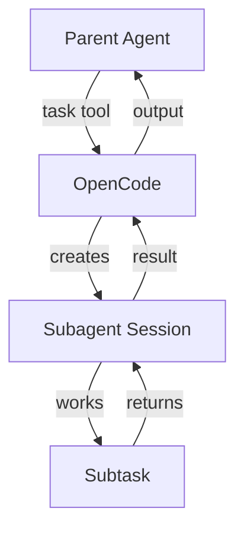
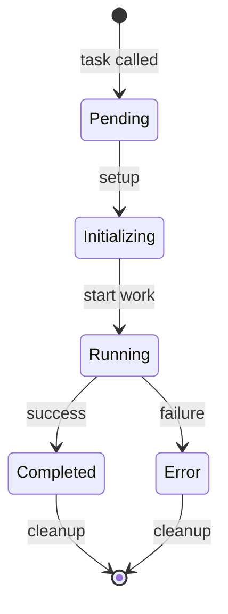
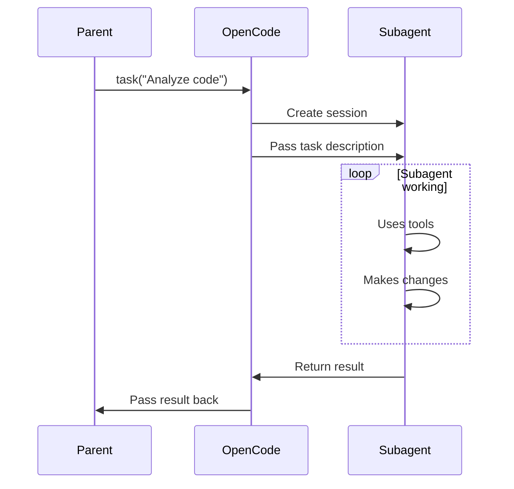
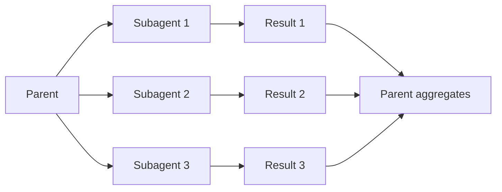
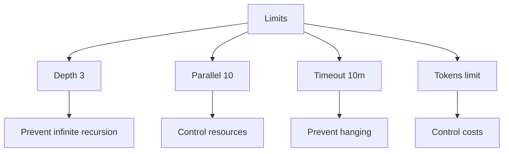

# Subagents

## Содержание

1. [Концепция Subagents](#концепция-subagents)
2. [Архитектура делегирования](#архитектура-делегирования)
3. [Жизненный цикл subagent](#жизненный-цикл-subagent)
4. [Коммуникация parent-child](#коммуникация-parent-child)
5. [Управление контекстом](#управление-контекстом)
6. [Параллельное выполнение](#параллельное-выполнение)
7. [Ограничения и квоты](#ограничения-и-квоты)

---

## Концепция Subagents

Subagents — это дочерние агенты, которых создаёт основной агент для выполнения подзадач.

Представьте, что вы руководитель проекта. У вас есть сложная задача, и вы делегируете её команде. Вы не делаете всё сами, а поручаете специалистам. Subagents — это такая "команда" для ИИ.

**Зачем нужны subagents:**
- Разбить большую задачу на части
- Выполнить работу параллельно
- Изолировать контекст разных задач
- Не засорять основной разговор

**Пример использования:**
```
Задача: "Проанализируй весь проект и найди баги"

Parent Agent:
├─ Subagent 1: "Анализируй backend код"
├─ Subagent 2: "Анализируй frontend код"
└─ Subagent 3: "Анализируй тесты"

Результаты собираются → Parent делает итоговый отчёт
```

---

## Архитектура делегирования

Subagents создаются через специальный tool и работают изолированно.

**Как это работает:**

1. Parent agent решает, что нужна подзадача
2. Вызывает `task` tool с описанием задачи
3. OpenCode создаёт новую сессию (subagent)
4. Subagent выполняет задачу независимо
5. Возвращает результат parent



**Изоляция:**
Каждый subagent имеет свою сессию с отдельным контекстом. Они не видят разговор parent и друг друга.

---

## Жизненный цикл subagent

Subagent проходит через несколько состояний от создания до завершения.

**Стадии:**

**1. Создание (Pending)**
Parent вызывает task tool. OpenCode готовит новую сессию.

**2. Инициализация (Initializing)**
Subagent получает системный prompt и описание задачи.

**3. Выполнение (Running)**
Subagent работает над задачей, может использовать tools.

**4. Завершение (Completed/Error)**
Subagent возвращает результат или ошибку.

**5. Уничтожение (Cleanup)**
Сессия subagent закрывается, ресурсы освобождаются.



---

## Коммуникация parent-child

Subagent общается с parent только через результат задачи.

**Что передаётся:**
- Описание задачи (prompt)
- Контекст (если нужен)
- Результат выполнения

**Что НЕ передаётся:**
- Промежуточные мысли subagent
- История разговора subagent
- Tools вызовы subagent

**Формат результата:**
```
{
  "summary": "Краткое описание результата",
  "output": "Детальный результат",
  "metadata": {
    "filesChanged": [...],
    "timeSpent": "...",
    "success": true/false
  }
}
```



---

## Управление контекстом

Контекст subagent изолирован от parent, но можно передать нужную информацию.

**Передача контекста:**
- Через prompt — описание задачи и контекст
- Через файлы — subagent видит файловую систему
- Через аргументы — конкретные параметры

**Ограничения контекста:**
- Subagent не видит историю parent
- Не знает о других subagents
- Не видит системные инструкции parent

**Best practice:**
Передавайте в prompt всё, что нужно subagent для работы. Будьте конкретны.

```
Parent: "Найди баги в файле src/auth.ts. 
         Вот контекст: используем JWT токены, 
         проблема в логине пользователей."

Subagent: *работает только с этой информацией*
```

---

## Параллельное выполнение

Несколько subagents могут работать одновременно, ускоряя выполнение задачи.

**Как это работает:**

Parent создаёт несколько subagents одновременно. Они работают параллельно. Parent ждёт все результаты.

**Пример параллельного анализа:**
```
Parent запускает:
├─ Subagent 1 → Анализ backend (2 мин)
├─ Subagent 2 → Анализ frontend (2 мин)
├─ Subagent 3 → Анализ tests (1 мин)
└─ Subagent 4 → Анализ docs (1 мин)

Общее время: 2 минуты (вместо 6 последовательно)
```

**Когда использовать параллельность:**
- Независимые задачи
- Анализ разных частей кода
- Проверки, которые не конфликтуют

**Когда НЕ использовать:**
- Задачи зависят друг от друга
- Нужна последовательность
- Риск конфликтов в файлах



---

## Ограничения и квоты

Subagents имеют ограничения для предотвращения злоупотреблений.

**Лимиты:**
- Максимальная глубина вложенности (обычно 3-5 уровней)
- Максимальное количество параллельных subagents
- Таймаут выполнения задачи
- Лимит токенов на subagent сессию

**Зачем ограничения:**
- Предотвратить бесконечную рекурсию
- Ограничить потребление ресурсов
- Контролировать стоимость API вызовов

**Примеры лимитов:**
```
Max depth: 3 levels
  Parent → Subagent → Sub-subagent

Max parallel: 10 subagents
  Parent может создать одновременно 10 subagents

Timeout: 10 minutes
  Subagent должен завершиться за 10 минут
```

**Что происходит при превышении:**
- Subagent прерывается
- Возвращается ошибка
- Parent может решить: повторить или отменить


