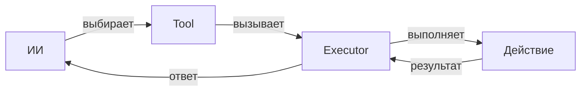
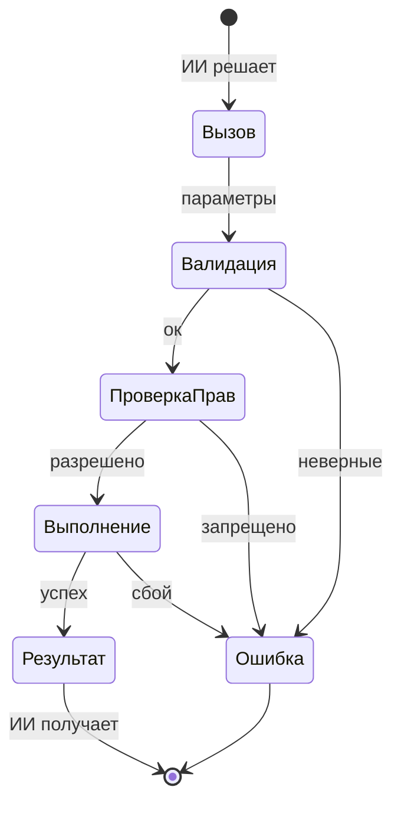
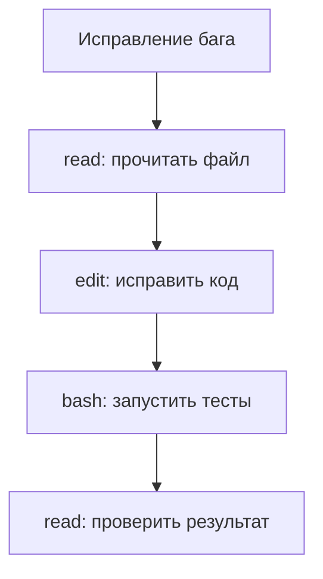
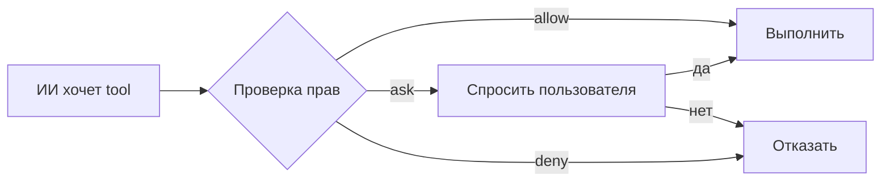

# Tools

## Содержание

1. [Архитектура Tool System](#архитектура-tool-system)
2. [Жизненный цикл инструмента](#жизненный-цикл-инструмента)
3. [Регистрация и разрешение](#регистрация-и-разрешение)
4. [Выполнение и контекст](#выполнение-и-контекст)
5. [Встроенные инструменты](#встроенные-инструменты)
6. [Кастомные инструменты](#кастомные-инструменты)
7. [Permission System](#permission-system)

---

## Архитектура Tool System

Tool System — это набор инструментов, которые ИИ использует для работы с кодом и системой.

Представьте, что ИИ — это работник, а tools — его инструменты: отвёртка, молоток, паяльник. Чтобы починить код, ИИ берёт нужный инструмент.

**Как работает:**
1. ИИ получает задачу
2. Выбирает подходящий tool
3. Вызывает его с параметрами
4. Получает результат
5. Продолжает работу

**Компоненты:**
- **Registry** — хранилище всех tools
- **Resolver** — находит tool по имени
- **Executor** — выполняет tool
- **Context** — информация о сессии



---

## Жизненный цикл инструмента

Каждый tool проходит через стадии от вызова до результата.

**Стадии:**

**1. Вызов (Invocation)**
ИИ решает использовать tool и формирует запрос с параметрами.

**2. Валидация (Validation)**
Проверка параметров на соответствие схеме. Если параметры неверные — ошибка.

**3. Проверка прав (Permission Check)**
Проверка, может ли ИИ использовать этот tool. Может запросить подтверждение.

**4. Выполнение (Execution)**
Запуск tool. Может обращаться к файлам, сети, базам данных.

**5. Результат (Result)**
Tool возвращает данные. ИИ использует их для продолжения работы.



---

## Регистрация и разрешение

Tools должны быть зарегистрированы, чтобы ИИ мог их использовать.

**Регистрация:**
- Встроенные tools регистрируются при старте OpenCode
- Кастомные tools регистрируются из папки `.opencode/tools/`
- MCP tools регистрируются при подключении сервера

**Разрешение (Resolution):**
Когда ИИ вызывает tool по имени, система:
1. Ищет tool в Registry
2. Проверяет, что tool доступен
3. Получает схему параметров
4. Подготавливает к выполнению

**Если tool не найден:**
ИИ получает ошибку и должен выбрать другой способ решения задачи.

---

## Выполнение и контекст

При выполнении tool получает доступ к контексту — информации о текущей сессии.

**Что в контексте:**
- `worktree` — путь к проекту
- `sessionID` — ID текущей сессии
- `directory` — текущая рабочая папка
- `agent` — какой агент используется

**Зачем нужен контекст:**
- Tool знает, где находится проект
- Может проверять права доступа
- Ведёт логи с привязкой к сессии
- Понимает, в каком режиме работает агент

**Пример:**
Tool `read` использует `worktree` из контекста, чтобы понять, откуда читать файлы.

---

## Встроенные инструменты

OpenCode поставляется с набором готовых tools для базовых операций.

**Основные tools:**

**read** — читает содержимое файла
**write** — создаёт или перезаписывает файл
**edit** — редактирует часть файла
**bash** — выполняет команду в терминале
**grep** — ищет текст в файлах
**glob** — находит файлы по шаблону
**list** — показывает содержимое папки

**Как ИИ использует:**
ИИ сам решает, какой tool нужен. Например, для исправления бага:
1. `read` — читает файл с багом
2. `edit` — исправляет код
3. `bash` — запускает тесты



---

## Кастомные инструменты

Вы можете создавать свои tools для специфических задач.

**Как создать:**
1. Создать файл в `.opencode/tools/`
2. Описать tool: название, параметры, что делает
3. OpenCode автоматически найдёт и зарегистрирует

**Пример кастомного tool:**
Получение погоды, отправка сообщений в Slack, запрос к вашему API.

**Преимущества:**
- Автоматизация рутинных задач
- Интеграция с внутренними системами
- Повторное использование

**Где хранятся:**
- `.opencode/tools/` — для конкретного проекта
- `~/.config/opencode/tools/` — для всех проектов

---

## Permission System

Система прав контролирует, что ИИ может делать с tools.

**Три уровня доступа:**

**allow** — разрешено без вопросов
ИИ использует tool свободно.

**ask** — спрашивать перед использованием
OpenCode покажет запрос, вы подтвердите или отклоните.

**deny** — запрещено
ИИ не может использовать tool.

**Настройка:**
В файле `opencode.json` вы указываете права для каждого tool:
```json
{
  "permission": {
    "read": "allow",
    "bash": "ask",
    "write": "deny"
  }
}
```

**Зачем нужно:**
- Безопасность — контроль над опасными операциями
- Прозрачность — вы знаете, что делает ИИ
- Гибкость — разные режимы для разных задач


